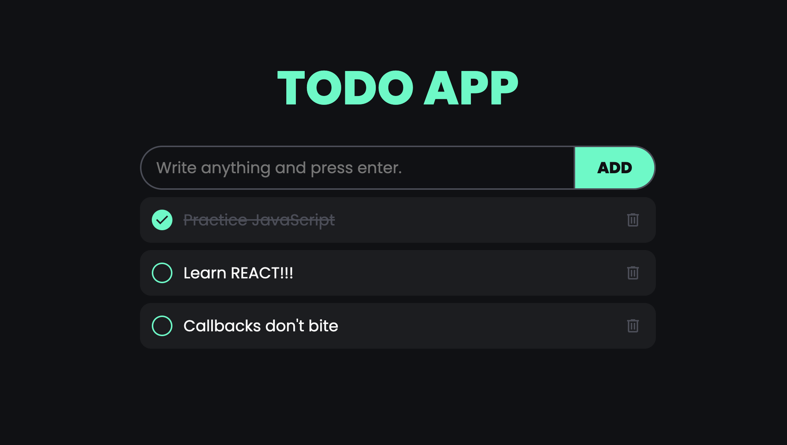

# ToDo App

This project is a simple To-Do application designed to sharpen my JavaScript, CSS, and HTML skills. The app allows users to add, delete, and mark tasks as completed. The tasks are stored in the browser's LocalStorage, so they persist even after the page is refreshed.

## Live Demo

Check out the live demo of the app [here](https://tehuanmelo.github.io/to-do-app/).



## Features

- Add new tasks
- Delete tasks
- Mark tasks as completed
- Persist tasks using LocalStorage

## Technologies Used

- HTML
- CSS
- JavaScript

## Getting Started

### Prerequisites

To run this project, you need a web browser that supports HTML5, CSS3, and JavaScript.

### Installation

1. Clone the repository:
    ```sh
    git clone https://github.com/your-username/to-do-app.git
    ```
2. Navigate to the project directory:
    ```sh
    cd to-do-app
    ```
3. Open `index.html` in your web browser.

### Usage

1. Open the app in your web browser.
2. Type a task into the input field and press "Enter" or click the "ADD" button to add the task to the list.
3. Click the checkbox next to a task to mark it as completed.
4. Click the delete button (trash can icon) next to a task to remove it from the list.

## Project Structure

```
to-do-app/
│
├── assets/
│   └── images/
│       └── demo.png
│
├── css/
│   └── styles.css
│
├── script/
│   └── index.js
│
├── index.html
└── README.md
```

- `index.html`: The main HTML file that contains the structure of the app.
- `css/styles.css`: The CSS file that contains the styles for the app.
- `script/index.js`: The JavaScript file that contains the logic for the app.
- `README.md`: This file.

## Learning Objectives

- Practice DOM manipulation using JavaScript.
- Understand and use LocalStorage for data persistence.
- Enhance CSS skills by styling the app.
- Improve HTML skills by structuring the app.

## License

This project is licensed under the MIT License. See the [LICENSE](LICENSE) file for details.

## Acknowledgements

- Icons from [SVGRepo](https://www.svgrepo.com/)
- Fonts from [Google Fonts](https://fonts.google.com/)

## Contributing

Contributions are welcome! Please feel free to submit a Pull Request.

---

Happy coding!